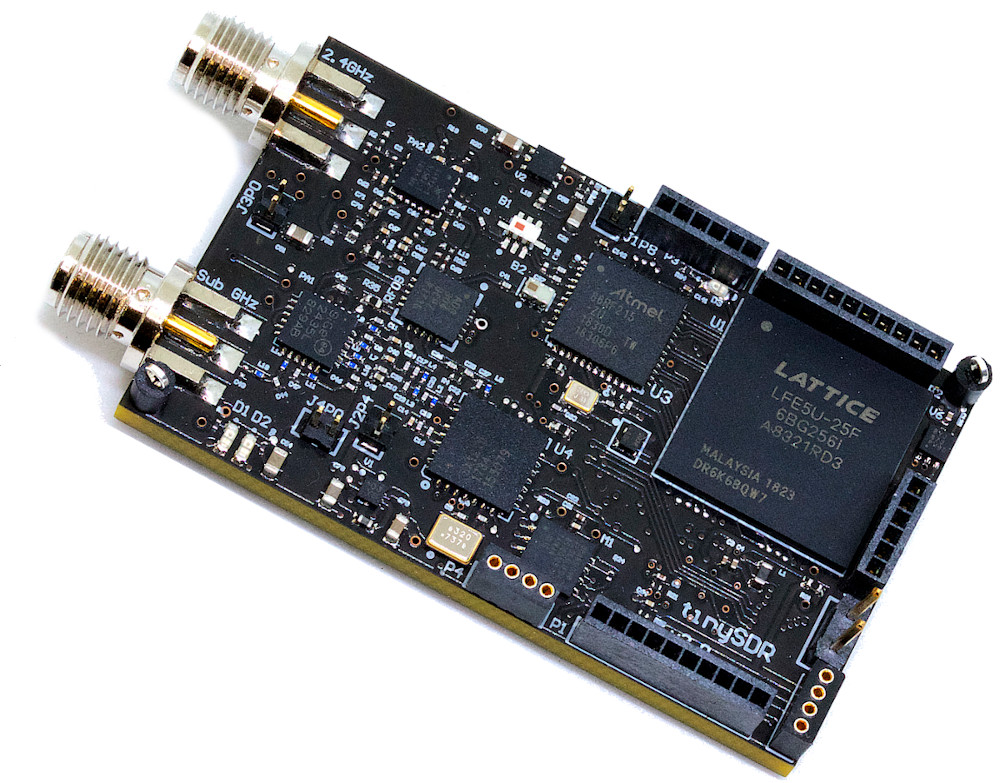

## Overview

TinySDR is the first software-defined radio platform specialized for internet-of-things networks.

### Hardware
TinySDR schematic is in [hardware](hardware/schematic.pdf). You can download [PCB design files](hardware/pcb-tinysdr.zip) to build TinySDR hardware.

### Firmware
TinySDR firmware CCS project is in [firmware](firmware/).

### FPGA Demos
TinySDR Bluetooth beacons and LoRa demos are in [demo](demo/).
- [LoRa Modulator](https://github.com/uw-x/lora-modulator)
- [FSK Modulator](https://github.com/mehrdadh/fsk-modulator)

### Contributers
  - [Mehrdad Hessar](https://github.com/mehrdadh)
  - [Ali Najafi](https://github.com/anajafi)
  - [Vikram Iyer](https://github.com/viyer)
  
