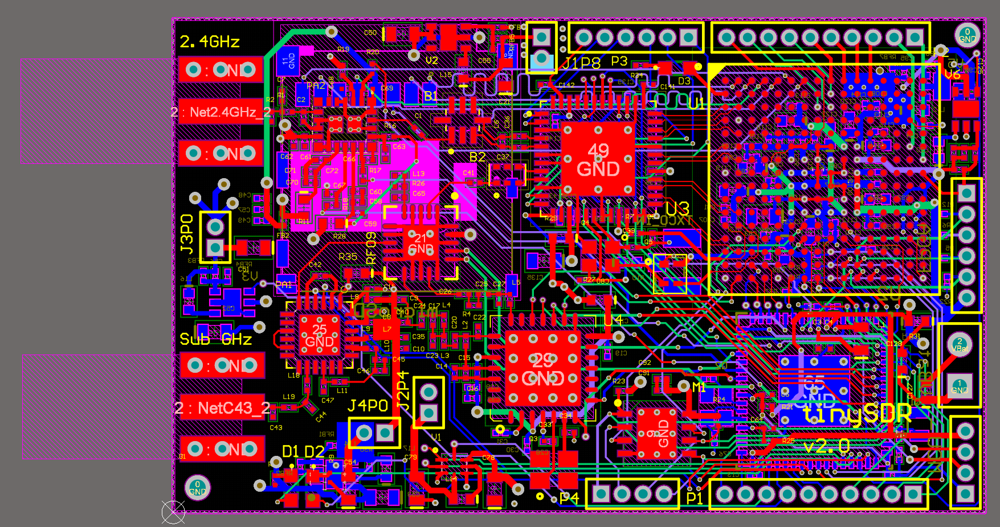
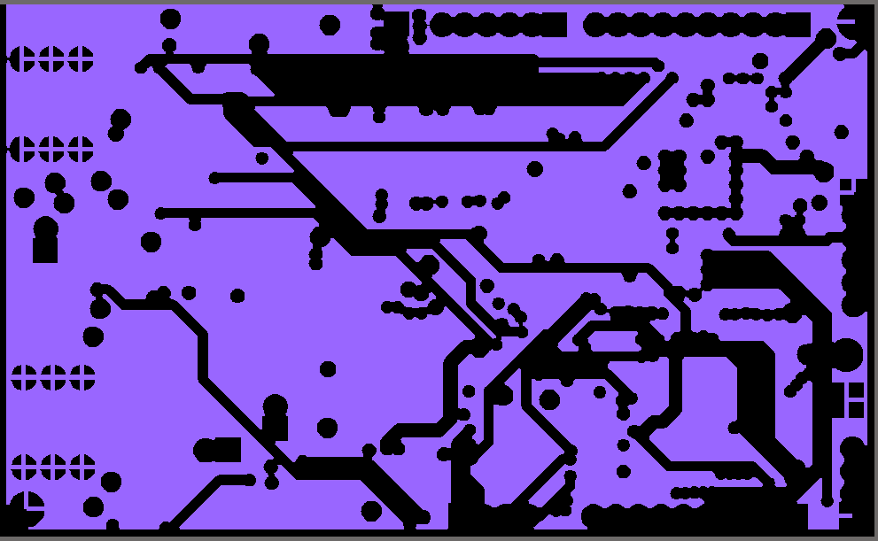
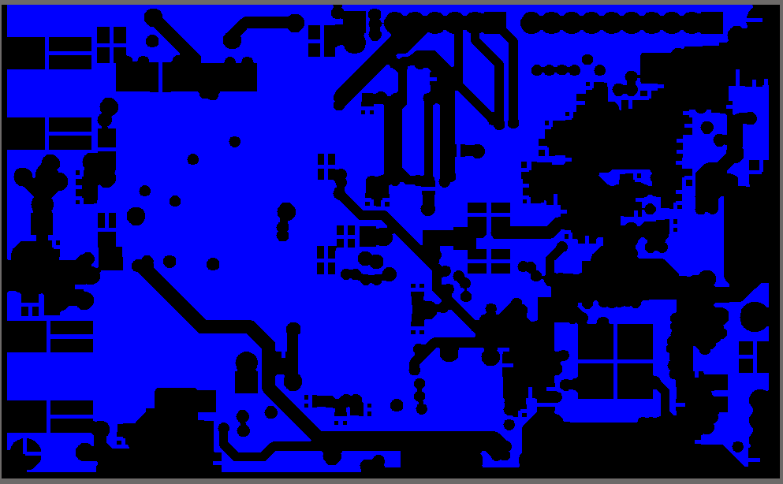

# Overview

TinySDR hardware designed with a six layers FR4 PCB material. We need six layer to implement multiple components with complex power plains that gives us flexibility to control power consumption in various scenarios.

We place RF paths on the top layer with impedance control for Sub-GHz and 2.4 GHz frequencies.

## Layers
After routing wires for all components we place polygons on each layer. In table below we show all the polygons and their purpose in our design.

| Layer       | Polygons Description |Image  |
| ----------- | ------------------- |-------|
| Top | Connected to GND.  Multiple Polygons.  Includes impedance control for both RF paths and LVDS connections. | |
| Inner 1 | Connected to GND. | |
| Inner 2 | Connected to GND. | |
| Inner 3 | Connected to GND. | |
| Inner 4 | Connected to Power.  Includes multiple polygons for various power planes. | |
| Bottom | Connected to GND. | |
